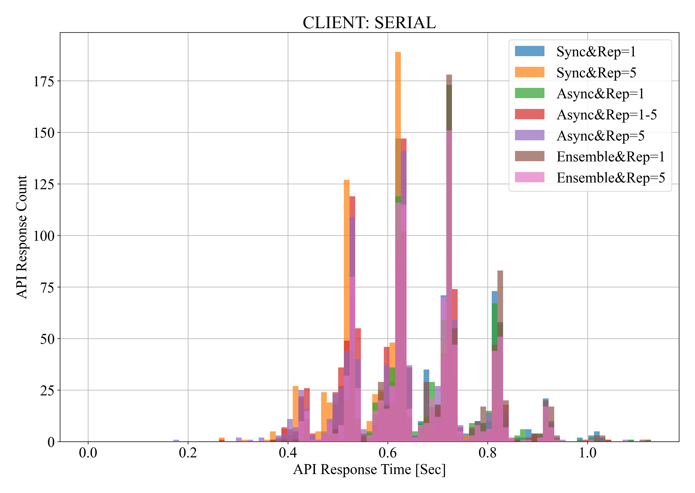
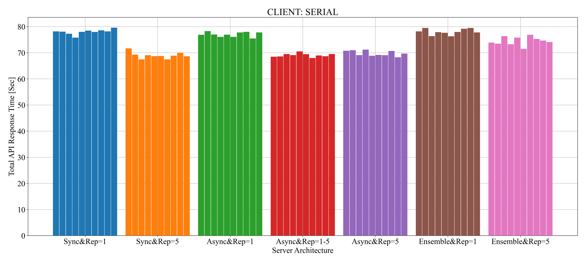
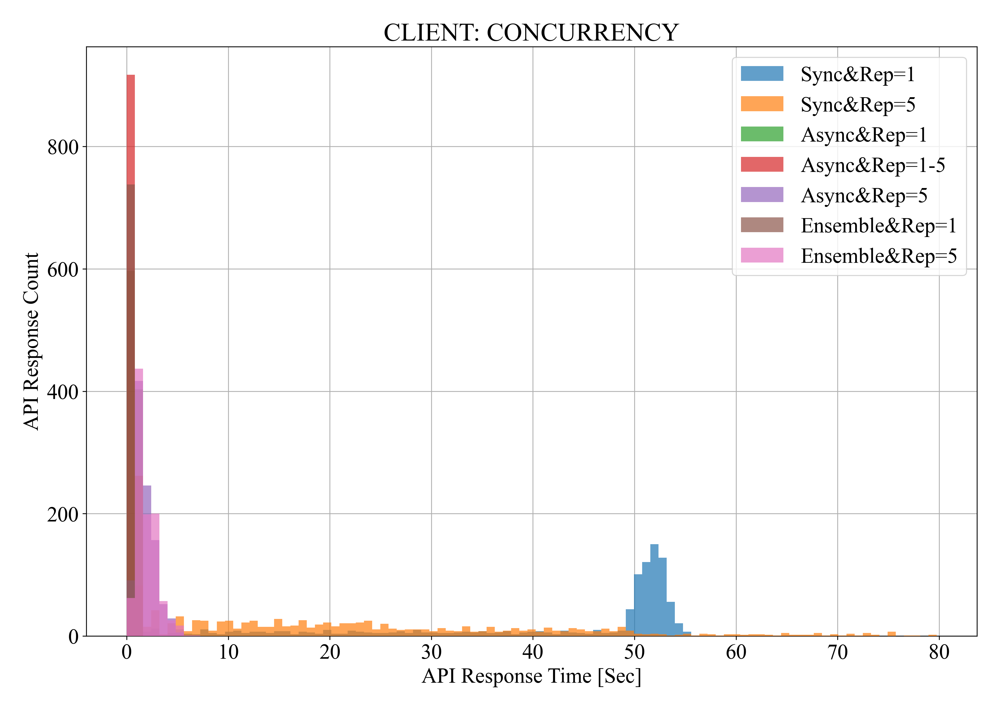
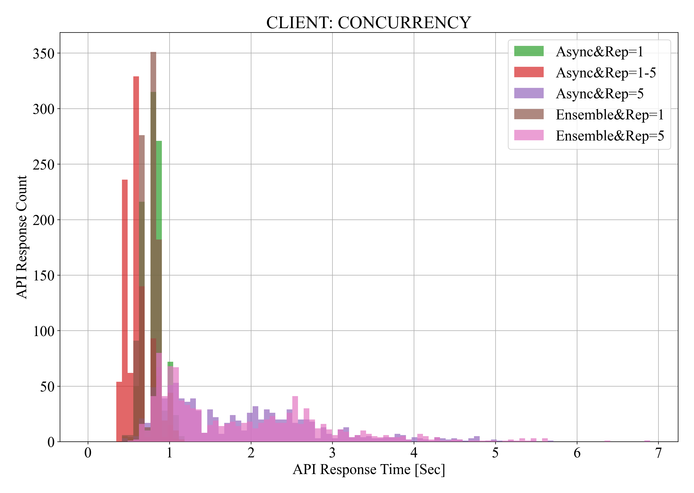
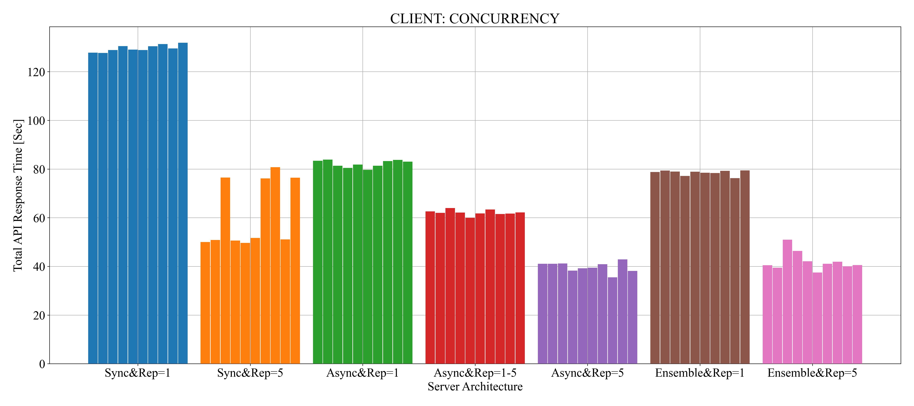
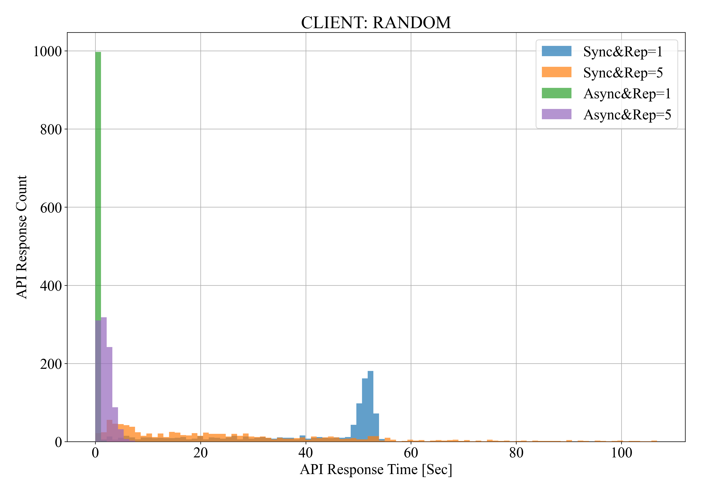
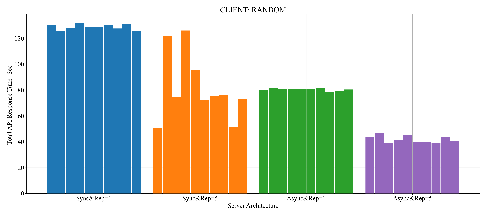

<h1 align = "center">
    :camera_flash: YOLO Serving Cookbook :camera_flash:
</h1>

<p align = "center">
       
</p>
<p align = "center">
        
</p>

## [1. Docker](https://github.com/Zerohertz/YOLO-Serving/tree/1.Docker)

<details>
<summary>
Architecture
</summary>
<div align="center">

</div>
</details>

## [2. Docker Compose](https://github.com/Zerohertz/YOLO-Serving/tree/2.Docker-Compose)

<details>
<summary>
Architecture
</summary>
<div align="center">

</div>
</details>

## 3. Kubernetes

<details>
<summary>
Architecture (without Ensemble)
</summary>

<table align="center">
<tr>
<td align="center">Number of Replicas = 1</td>
<td align="center">Number of Replicas = 5</td>
</tr>
<tr>
<td align="center"></td>
<td align="center"></td>
</tr>
</table>

</details>

<details>
<summary>
Architecture (with Ensemble)
</summary>

<table align="center">
<tr>
<td align="center">Number of Replicas = 1</td>
<td align="center">Number of Replicas = 5</td>
</tr>
<tr>
<td align="center"></td>
<td align="center"></td>
</tr>
</table>

</details>

### Experimental Setup

+ Server
  + `Sync`: FastAPI에서 동기 처리
  + `Async`: FastAPI에서 비동기 처리
  + `Rep`: `fastapi`와 `triton-inference-server`의 replica 수
  + `Ensemble`: `triton-inference-server` 내에서 [ensemble](https://github.com/triton-inference-server/server/blob/main/docs/user_guide/architecture.md#ensemble-models)을 활용해 전, 후처리 및 시각화를 수행 (`fastapi`는 비동기로 작동)
+ Client (FastAPI를 100회 호출, 10회 실험)
  + `Serial`: `for`문을 이용해 직렬적 호출
  + `Concurrency`: `ThreadPoolExecutor`를 이용해 동시 호출
  + `Random`: `ThreadPoolExecutor`를 이용 및 0 ~ 20초 이후 랜덤 호출

### Results

<div align="center">

|Server Arch.|Mean(Serial)|End(Serial)|Mean(Concurrency)|End(Concurrency)|Mean(Random)|End(Random)|
|:-:|:-:|:-:|:-:|:-:|:-:|:-:|
|[Sync&Rep=1](https://github.com/Zerohertz/YOLO-Serving/tree/3.Kubernetes-1.Sync)|0.69|78.01|41.93|129.61|40.05|128.63|
|[Sync&Rep=5](https://github.com/Zerohertz/YOLO-Serving/tree/3.Kubernetes-1.Sync)|0.60|68.99|25.57|61.38|26.88|81.69|
|[Async&Rep=1](https://github.com/Zerohertz/YOLO-Serving/tree/3.Kubernetes-2.Async)|0.68|77.02|0.80|82.22|0.78|80.34|
|[Async&Rep=1-5](https://github.com/Zerohertz/YOLO-Serving/tree/3.Kubernetes-2.Async)|0.61|69.07|0.60|62.11|-|-|
|[Async&Rep=5](https://github.com/Zerohertz/YOLO-Serving/tree/3.Kubernetes-2.Async)|0.62|69.77|1.84|39.77|1.91|41.84|
|[Ensemble&Rep=1](https://github.com/Zerohertz/YOLO-Serving/tree/3.Kubernetes-3.Ensemble)|0.70|78.02|0.77|78.50|-|-|
|[Ensemble&Rep=5](https://github.com/Zerohertz/YOLO-Serving/tree/3.Kubernetes-3.Ensemble)|0.66|74.52|1.90|42.03|-|-|

</div>

<details>
<summary>
Figures
</summary>

<table align="center">
<tr>
<td align="center"></td>
<td align="center"></td>
</tr>
</table>

<table align="center">
<tr>
<td align="center"></td>
<td align="center"></td>
</tr>
<tr>
<td colspan="2" align="center"></td>
</tr>
</table>

<table align="center">
<tr>
<td align="center"></td>
<td align="center"></td>
</tr>
</table>

</details>

### Discussion

#### Sync vs. Async

<details>
<summary>
<code>async def</code>로 정의된 FastAPI에서 <code>Random</code> 조건의 오류 발생
</summary>

```python
Traceback (most recent call last):
  File "anaconda3\lib\site-packages\requests\models.py", line 972, in json
    return complexjson.loads(self.text, kwargs)
  File "anaconda3\lib\site-packages\simplejson\__init__.py", line 514, in loads
    return _default_decoder.decode(s)
  File "anaconda3\lib\site-packages\simplejson\decoder.py", line 386, in decode
    obj, end = self.raw_decode(s)
  File "anaconda3\lib\site-packages\simplejson\decoder.py", line 416, in raw_decode
    return self.scan_once(s, idx=_w(s, idx).end())
simplejson.errors.JSONDecodeError: Expecting value: line 1 column 1 (char 0)

During handling of the above exception, another exception occurred:

Traceback (most recent call last):
  File "Downloads\curl.py", line 70, in <module>
    main(i)
  File "Downloads\curl.py", line 53, in main
    responses = list(
  File "anaconda3\lib\concurrent\futures\_base.py", line 609, in result_iterator
    yield fs.pop().result()
  File "anaconda3\lib\concurrent\futures\_base.py", line 439, in result
    return self.__get_result()
  File "anaconda3\lib\concurrent\futures\_base.py", line 391, in __get_result
    raise self._exception
  File "anaconda3\lib\concurrent\futures\thread.py", line 58, in run
    result = self.fn(*self.args, self.kwargs)
  File "Downloads\curl.py", line 24, in send_request
    res = response.json()
  File "anaconda3\lib\site-packages\requests\models.py", line 976, in json
    raise RequestsJSONDecodeError(e.msg, e.doc, e.pos)
requests.exceptions.JSONDecodeError: Expecting value: line 1 column 1 (char 0)
```

이는 `Random` 조건에서 발생하는 오류인데, `Concurrency` 조건에선 발생하지 않는게 이상하다.
모든 pod에 대해 로그가 남아있나 살펴봤지만 발견하지 못했다.
아마 비동기적으로 `triton-inference-server`의 service를 호출하다가 생긴 오류로 보인다.

> Chat GPT 선생님의 답변

FastAPI를 사용하면서 특정 패턴의 요청에서만 오류가 발생하는 경우, 다양한 원인이 있을 수 있습니다. 다음은 몇 가지 가능성에 대해 설명합니다:

1. 리소스 한계: 서버 또는 사용 중인 데이터베이스의 연결 수나 기타 리소스 한계에 도달할 수 있습니다. 한 순간에 100회 요청을 보낼 때, 각 요청이 빠르게 처리되어서 리소스가 빠르게 해제되면 문제가 없을 수 있습니다. 그러나 100회의 요청을 20초 동안 지속적으로 보낼 경우, 그 사이에 리소스가 해제되지 않아 문제가 발생할 수 있습니다.
2. 레이트 리밋팅: 일부 시스템은 짧은 시간 동안 너무 많은 요청을 처리하는 것을 방지하기 위해 레이트 리밋팅(rate limiting)을 사용합니다. 그렇기 때문에 20초 동안 꾸준히 요청을 보내면 제한에 걸릴 수 있습니다.
3. 메모리 문제: 요청이 누적되면서 서버의 메모리 사용량이 늘어날 수 있습니다. 만약 메모리가 부족하다면, 요청 처리 중에 에러가 발생할 수 있습니다.
4. 중복 요청 처리: 20초 동안 지속적으로 요청을 보낼 때, 이전 요청의 결과나 상태가 다음 요청의 처리에 영향을 줄 수 있습니다. 중복되는 요청이나 상태 변경이 원인이 될 수 있습니다.
5. 로깅 또는 모니터링 도구: 요청을 처리하는 동안 로그를 남기거나 모니터링 도구를 사용하는 경우, 요청 빈도가 높아지면 추가적인 부하가 발생할 수 있습니다.

+ 해결 방법
  + 로깅: 발생하는 오류의 로그를 확인하여 구체적인 원인을 파악합니다.
  + 프로파일링: 서버의 CPU, 메모리, 네트워크 사용량 등의 리소스 사용 상황을 모니터링하여 병목 현상이나 리소스 부족 문제를 파악합니다.
  + 테스팅: 서버에 요청을 보내는 다양한 시나리오를 테스트하여 문제의 원인을 파악합니다.

이러한 점검을 통해 문제의 원인을 파악하고 적절한 조치를 취할 수 있습니다.

</details>


#### Replicas

<details>
<summary>
<code>WORKER TIMEOUT</code>
</summary>

`fastapi`의 replica는 1개, `triton-inference-server`의 replica는 5개 일 때는 발생하지 않던 오류가 `fastapi`의 replica는 5개, `triton-inference-server`의 replica는 5개 일 때 아래와 같이 발생했다.
이것은 `"--timeout", "120"`을 `Dockerfile`에 추가하여 해결했다.

```bash
[1] [CRITICAL] WORKER TIMEOUT (pid:8)
[1] [WARNING] Worker with pid 8 was terminated due to signal 6
[379] [INFO] Booting worker with pid: 379
[379] [INFO] Started server process [379]
[379] [INFO] Waiting for application startup.
[379] [INFO] Application startup complete.
```

</details>

#### Autoscaling

`HPA` 사용 시 한 순간에 100회의 요청이 입력되면 replica를 생성하기 전에 단일 `fastapi` pod에 입력되기 때문에 autoscaling 효과를 볼 수 없다.
따라서 autoscaling을 원활히 하려면 `Resource` 기준이 아닌 새로운 `metrics`가 필요하다.

<details>
<summary>
예시: <code>hpa.yaml</code>
</summary>

```yaml
apiVersion: autoscaling/v2beta2
kind: HorizontalPodAutoscaler
metadata:
  name: triton-inference-server-hpa
spec:
  scaleTargetRef:
    apiVersion: apps/v1
    kind: Deployment
    name: triton-inference-server
  minReplicas: 1
  maxReplicas: 5
  metrics:
    - type: Resource
      resource:
        name: cpu
        target:
          type: Utilization
          averageUtilization: 80
    - type: Resource
      resource:
        name: memory
        target:
          type: Utilization
          averageUtilization: 80
---
apiVersion: autoscaling/v2beta2
kind: HorizontalPodAutoscaler
metadata:
  name: fastapi-hpa
spec:
  scaleTargetRef:
    apiVersion: apps/v1
    kind: Deployment
    name: fastapi
  minReplicas: 1
  maxReplicas: 5
  metrics:
    - type: Resource
      resource:
        name: cpu
        target:
          type: Utilization
          averageUtilization: 80
    - type: Resource
      resource:
        name: memory
        target:
          type: Utilization
          averageUtilization: 80
```

</details>

### [3.4. Gradio](https://github.com/Zerohertz/YOLO-Serving-Cookbook/tree/3.Kubernetes-4.Gradio)

<div align="center">


</div>